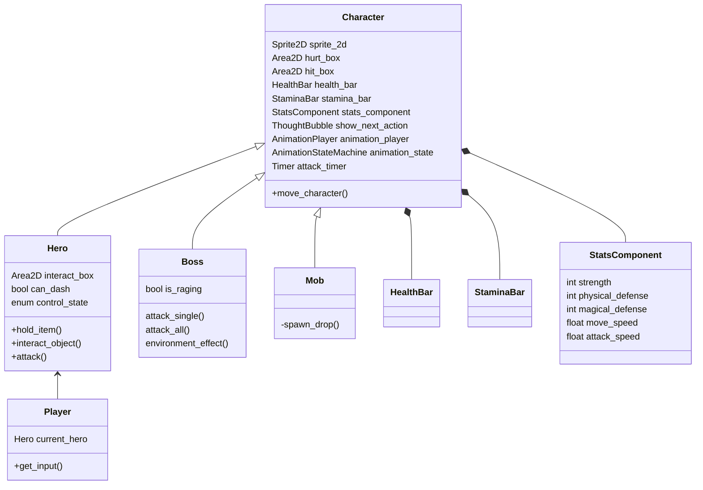

# Actors

```mermaid
classDiagram
	Character <|-- Hero
	Character <|-- Boss
	Character <|-- Mob
	Character *-- HealthBar
	Character *-- StaminaBar
	Character *-- StatsComponent
	Hero <-- Player
	class Character {
		Sprite2D sprite_2d
		Area2D hurt_box
		Area2D hit_box
		HealthBar health_bar
		StaminaBar stamina_bar
		StatsComponent stats_component
		ThoughtBubble show_next_action
		AnimationPlayer animation_player
		AnimationStateMachine animation_state
		Timer attack_timer
		+move_character()
	}
	class Hero {
		Area2D interact_box
		bool can_dash
		enum control_state
		+hold_item()
		+interact_object()
		+attack()
		
	}
	class Boss {
		bool is_raging
		attack_single()
		attack_all()
		environment_effect()
	}
	class Mob {
		-spawn_drop()
	}
	class StatsComponent {
	int strength
	int physical_defense
	int magical_defense
	float move_speed
	float attack_speed
	}
	class Player {
		Hero current_hero
		+get_input()
	}
	
```